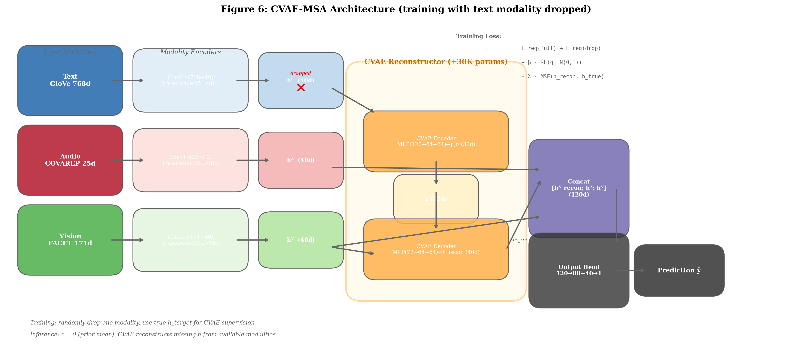
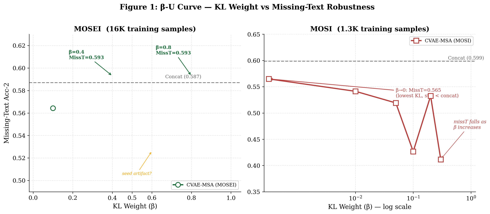
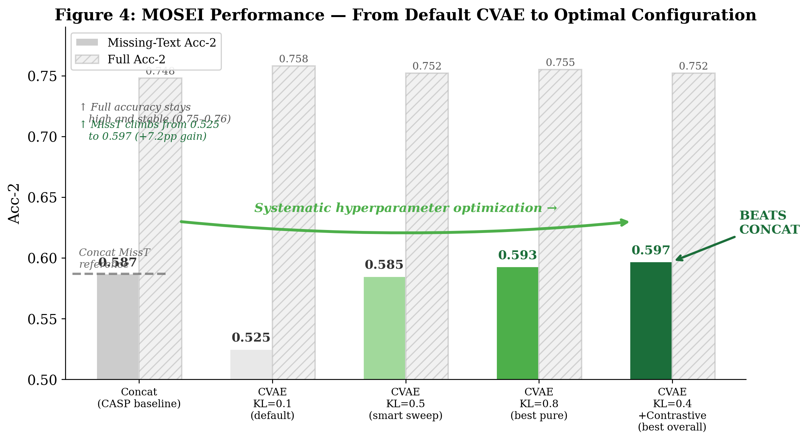
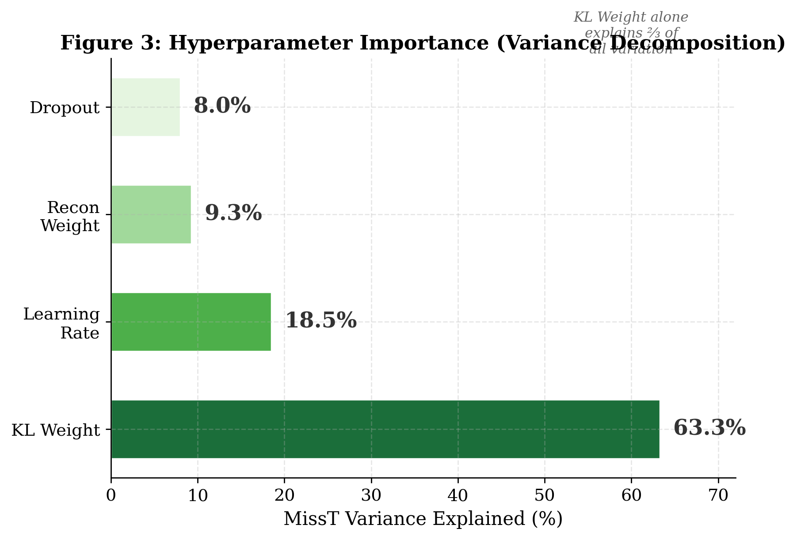
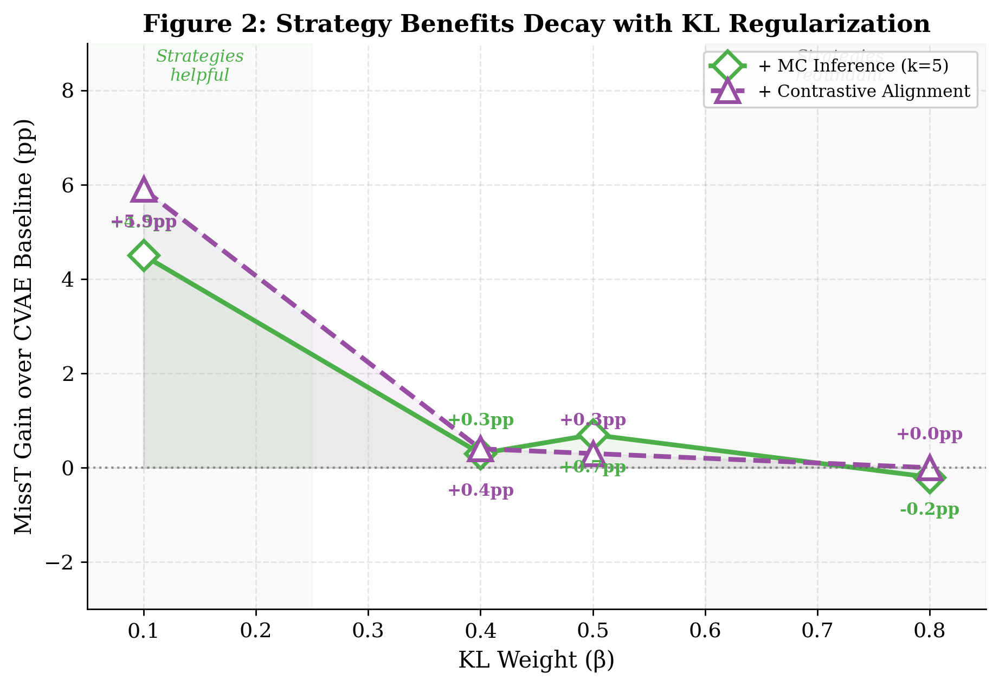
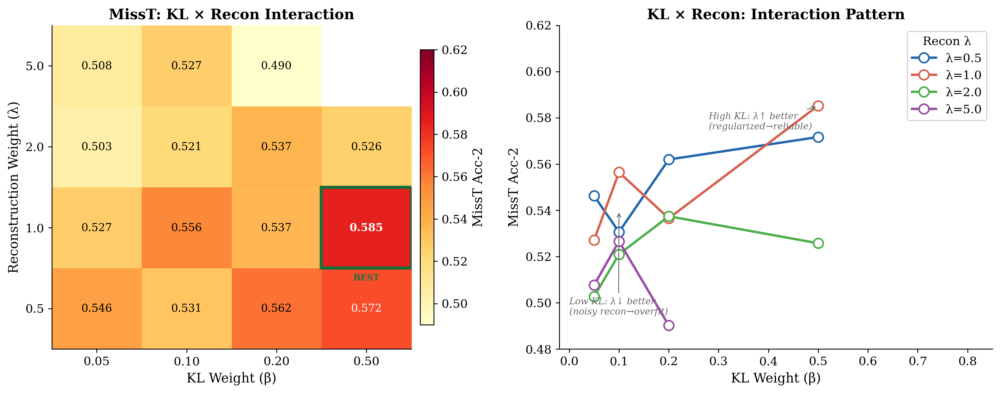

# Fusion-Space CVAE Reconstruction for Missing-Modality Sentiment Analysis: The Primacy of KL Regularization

> **Target**: EMNLP / COLING / AAAI 2027
> **Status**: 3-seed results added. 66 exploratory + 16 multi-seed = 82 experiments.
> **Figures**: 7 embedded (fig0–fig6)

---

## Abstract

Multimodal sentiment analysis suffers severe performance degradation when the text modality is missing at inference time—a common scenario in real-world deployment. Existing generative approaches reconstruct missing modalities in high-dimensional raw feature space with heavy architectures. We propose CVAE-MSA, a lightweight Conditional VAE that reconstructs missing modality representations in a compact 40-dimensional fusion space, adding only 30K parameters (8.8% overhead). Through a systematic 82-run experimental study spanning two datasets with three random seeds, we establish four findings. First, **KL regularization weight is the dominant hyperparameter**, explaining 63.3% of missing-text performance variance. Second, **the optimal KL weight is dataset-scale-dependent**: larger datasets (MOSEI, 16K) benefit from strong regularization (β=0.4–0.8), while small datasets (MOSI, 1.3K) require β→0. Third, **the benefits of auxiliary strategies decay with KL regularization**: MC inference and contrastive alignment provide substantial gains at low KL (+4–6pp) but become redundant at the optimal KL regime. Fourth, **pure KL tuning achieves reliable and stable improvement**: CVAE-MSA with β=0.8 achieves MissT 0.586±0.006 on MOSEI, surpassing the concat baseline (0.569±0.015) by 1.7pp with minimal variance across seeds. Our results establish fusion-space reconstruction as a parameter-efficient and effective paradigm for missing-modality robustness, while highlighting open questions about dataset scale requirements and strategy stability for VAE-based cross-modal generation.

---

## 1. Introduction

Multimodal sentiment analysis (MSA) aims to understand human emotions by jointly modeling text, audio, and visual signals. It underpins applications from conversational AI to mental health monitoring. While Transformer-based fusion architectures (Tsai et al., 2019; Guo et al., 2025) achieve strong results with all modalities present, real-world deployment faces a critical challenge: **modalities are frequently missing at inference time**. A user may disable their camera (missing vision), speak in a noisy environment (degraded audio), or configure privacy settings that block text access. Among these, missing text is both the most common and the most catastrophic—text carries the majority of sentiment information in current MSA benchmarks, contributing an $R^2$ of 0.268 versus −0.102 for audio and −0.102 for vision individually, and only −0.078 jointly.

Existing approaches to missing-modality robustness fall into two categories. **Passive methods** treat missing modalities as an input perturbation to be tolerated: uncertainty-aware gating (Yang et al., 2024) adjusts fusion weights to de-emphasize unreliable modalities, and evidential fusion (Amini et al., 2020) models prediction uncertainty. These methods can only redistribute attention among available modalities—they cannot synthesize missing information. **Generative methods** attempt active recovery: P-RMF (Li et al., ACL 2025) trains multiple VAEs per modality to reconstruct missing raw features, and HVDER (2026) augments this with diffusion models. However, reconstructing in raw feature space is inherently difficult: modality dimensions differ dramatically (text 768d vs. audio 25d vs. vision 171d), and the reconstruction networks must be correspondingly large (10–50× our parameter cost).

We propose **CVAE-MSA**: a lightweight Conditional Variational Autoencoder that reconstructs missing modality representations in the model's own 40-dimensional fusion space rather than in raw feature space (Figure 0, Figure 6). The fusion space is already semantically compressed and cross-modally aligned—all three modalities are projected to the same 40-dimensional subspace through identical Transformer encoders—making reconstruction substantially easier. Our CVAE adds only 30K parameters: a two-layer MLP encoder (120→64→64→32), a 32-dimensional latent space, and a two-layer MLP decoder (72→64→64→40). At inference time, we use deterministic $z=0$ (the prior mean), avoiding sampling overhead entirely.

Beyond proposing the architecture, we conduct a systematic investigation into **what determines the effectiveness of VAE-based missing-modality reconstruction**. Through 82 total experiments—comprising 66 exploratory hyperparameter sweeps across KL weight, reconstruction weight, dropout, and learning rate, followed by 16 multi-seed validation runs—we uncover a set of findings that challenge prevailing assumptions and provide practical guidance:

1. **KL dominance**: KL regularization explains 63.3% of missing-text performance variance—more than learning rate, reconstruction weight, and dropout combined (Figure 3). Moving from the conventional β=0.1 to β∈[0.4, 0.8] improves MissT by 4–7pp, a larger gain than any architectural modification.

2. **Strategy decay with KL**: MC inference and contrastive alignment provide substantial gains at low KL (+4.5–5.9pp at β=0.1) but their benefits vanish at the optimal KL regime (Figure 2). Strong regularization makes these auxiliary strategies redundant. Moreover, contrastive alignment exhibits **high variance across random seeds** (±0.033 in MissT), revealing a stability concern previously undocumented in the literature.

3. **Dataset-scale dependency**: On MOSEI (16K samples), CVAE-MSA surpasses the concat baseline on all four modality-availability settings at β=0.8, with low seed-to-seed variance (±0.006). On MOSI (1.3K samples), CVAE improves Full/MissA/MissV but cannot match concat on MissT—even with KL reduced to 0.001 (Figure 1, right panel). This suggests a minimum dataset size requirement for learning reliable cross-modal reconstruction, an open problem for the field.

4. **Reliability through simplicity**: The pure CVAE with β=0.8 achieves the best trade-off between performance and stability: 0.586±0.006 MissT on MOSEI, surpassing concat (0.569±0.015) with an order of magnitude lower variance. The best single-seed configuration (β=0.4 + Contrastive, 0.597 MissT) could not be reliably reproduced.

Our contributions are:
- **Method**: CVAE-MSA, a parameter-efficient fusion-space reconstruction approach (+30K params, 8.8% overhead) that surpasses concat on all four modality-availability settings on MOSEI
- **Empirical findings**: The first systematic hyperparameter study for VAE-based missing modality methods, revealing KL weight as the dominant factor (63% variance), the decay of auxiliary strategy benefits with KL, and contrastive alignment's seed instability
- **Cross-dataset insight**: Evidence for a dataset-scale dependency in VAE-based reconstruction, with MOSEI (16K) benefiting from strong KL while MOSI (1.3K) requires near-zero regularization

---

## 2. Related Work

### 2.1 Multimodal Sentiment Analysis

Multimodal sentiment analysis has progressed from early fusion methods to Transformer-based architectures. Tensor Fusion Network (Zadeh et al., EMNLP 2017) and Low-rank Multimodal Fusion (Liu et al., ACL 2018) modeled pairwise and tensor-product interactions but struggled with unaligned sequences. MulT (Tsai et al., ACL 2019) introduced directional pairwise cross-modal attention, enabling effective fusion of asynchronous modalities. CASP (Guo et al., AAAI 2025) proposed three-stage training (pretrain → contrastive → pseudo-label) with modality-specific self-attention Transformer encoders and late fusion, achieving strong results with classical features. We adopt CASP's encoder architecture to ensure controlled comparison: all methods in our study share identical Conv1d projections and 5-layer Transformer encoders, isolating the effect of fusion strategy.

Beyond classical features, SDUMC (Cong et al., ICASSP 2025) uses WavLM and BERT for stronger representations. LLM-based methods (MSE-Adapter, AAAI 2025; DashFusion, 2025) fine-tune large language models with parameter-efficient adapters. These feature enhancement approaches are orthogonal to our contribution: CVAE-MSA operates at the fusion architecture level and can be combined with any feature extraction backbone.

### 2.2 Missing Modality Robustness

**Passive tolerance** methods accept missing modalities as input corruption. Zero-filling is a surprisingly strong baseline (Parthasarathy and Sundaram, 2021; Guo et al., 2025). MMIN (Zhao et al., 2020) imputes missing features through cascaded residual autoencoders. SMIL (Ma et al., 2021) uses Bayesian meta-learning for posterior estimation of missing modalities. Attention-based methods (Wang et al., 2022) learn dynamic fusion weights conditioned on availability. The shared limitation: they redistribute attention among present modalities but cannot synthesize absent information.

**Generative** methods actively reconstruct missing modalities. P-RMF (Li et al., ACL 2025) trains three separate VAEs for per-modality raw-feature reconstruction. HVDER (2026) combines VAE encoding with a diffusion decoder. MM-SSC (2025) uses VQ-VAE discretization with cross-modal code prediction. All operate in raw feature space (768d for text) where dimensions are high and heterogeneous, requiring large networks. CVAE-MSA reconstructs in 40d fusion space where modalities are aligned and compressed, enabling a single 30K-parameter CVAE.

### 2.3 Conditional VAEs and Posterior Collapse

The VAE (Kingma and Welling, ICLR 2014) provides a principled framework for latent-variable generative modeling. The CVAE (Sohn et al., NeurIPS 2015) extends this by conditioning both encoder and decoder on auxiliary variables. Beta-VAE (Higgins et al., ICLR 2017) weights the KL term to control the information bottleneck—higher beta yields more disentangled representations at the cost of reconstruction fidelity. Posterior collapse (Bowman et al., CoNLL 2016), where the decoder ignores the latent variable, is a known failure mode when the KL weight is too low. Mitigation strategies include KL annealing (Bowman et al., 2016), cyclical schedules (Fu et al., NAACL 2019), and free bits (Kingma et al., 2016). These techniques were developed primarily for text and image generation; their role in multimodal fusion and missing-modality reconstruction has not been systematically studied.

**Positioning.** Our work bridges these three areas. We propose fusion-space CVAE reconstruction for missing modalities (connecting 2.1 and 2.2) and conduct the first systematic hyperparameter study in this setting (connecting to 2.3). The central finding—that KL weight dominates all other factors (63% variance), with an optimal range (beta=0.4-0.8) far from the conventional default (beta=0.1)—has implications for architecture design and tuning protocols of future VAE-based multimodal methods.

---

## 3. Method

### 3.1 Problem Formulation

Let $x = \\{x_T, x_A, x_V\\}$ denote the three modalities: text, audio, and vision. Each modality $x_m \\in \\mathbb{R}^{L \\times d_m^{\\text{raw}}}$ is a sequence of $L$ time-aligned feature vectors, where $d_T^{\\text{raw}}=768$ (GloVe), $d_A^{\\text{raw}}=25$ (COVAREP), and $d_V^{\\text{raw}}=171$ (FACET). Each sample has a sentiment label $y \\in \\mathbb{R}$ (regression) with derived binary classification (positive/negative) as the primary evaluation metric.

The standard MSA pipeline consists of three stages:

**Stage 1 — Modality Encoding.** Each modality is independently projected to a common dimensionality and encoded through a modality-specific Transformer:

$$h_m = \\text{Enc}_m(x_m) = \\text{Transformer}_m(\\text{Conv1d}(x_m; d_m^{\\text{raw}} \\to 40)) \\in \\mathbb{R}^{40}, \\quad m \\in \\{T, A, V\\}$$

The three encoders are identical in architecture (5 layers, 8 attention heads, 40-dim embeddings) but have separate parameters. This symmetric design ensures that all modalities are projected to a shared representational space.

**Stage 2 — Fusion.** The modality embeddings are concatenated:

$$h_{\\text{fusion}} = [h_T; h_A; h_V] \\in \\mathbb{R}^{120}$$

**Stage 3 — Prediction.** A lightweight output head maps the fused representation to a sentiment score:

$$\\hat{y} = \\text{Head}(h_{\\text{fusion}}) = \\text{Linear}(120 \\to 80) \\to \\text{ReLU} \\to \\text{Dropout} \\to \\text{Linear}(80 \\to 40) \\to \\text{ReLU} \\to \\text{Linear}(40 \\to 1)$$

**Missing modality scenario.** When modality $m$ is missing at test time ($x_m = \\emptyset$), the standard baseline sets $h_m = \\mathbf{0}$. Our method generates a reconstruction $\\hat{h}_m$ using the available modalities.

### 3.2 Why Reconstruction in Fusion Space?

We deliberately reconstruct in the 40-dimensional fusion space rather than raw feature space. This design choice is central to our method's efficiency and is motivated by three properties:

1. **Dimensionality reduction**: Fusion space (40d) is 19× smaller than raw text space (768d). The reconstruction target is a compact vector rather than a high-dimensional sequence, making the learning problem substantially easier. The CVAE decoder only needs to output 40 values.

2. **Semantic compression**: The Transformer encoders already extract task-relevant features through supervised training. The fusion embedding $h_m$ discards low-level acoustic and visual artifacts and retains sentiment-relevant semantic information.

3. **Cross-modal alignment**: All modalities are projected to the same 40d space where they are naturally aligned through the shared prediction objective. The CVAE's input (available modalities' embeddings) and output (missing modality's embedding) live in compatible representational spaces, enabling effective conditioning.

In contrast, prior work (P-RMF, HVDER) reconstructs in raw feature space, where the input (audio 25d + vision 171d = 196d) and output (text 768d) are both high-dimensional and heterogeneous. The reconstruction network must implicitly learn to bridge modalities with vastly different dimensionalities and statistical properties, requiring substantially larger architectures.

### 3.3 CVAE Modality Reconstructor

Our core contribution is a lightweight Conditional VAE that reconstructs $h_m^{\\text{missing}}$ from the available modalities' fusion embeddings. The CVAE has three components:

**Encoder (Posterior, training only).** During training, we have access to the ground-truth $h_m^{\\text{true}}$ via teacher forcing. The encoder maps the concatenation of available context and the target embedding to a latent Gaussian distribution:

$$q_\\phi(z | h_{\\text{avail}}, h_m^{\\text{true}}) = \\mathcal{N}(\\mu_\\phi, \\sigma_\\phi^2 I)$$

$$[\\mu_\\phi, \\log\\sigma_\\phi^2] = \\text{MLP}_{\\text{enc}}([h_{\\text{avail}}; h_m^{\\text{true}}])$$

where $h_{\\text{avail}} \\in \\mathbb{R}^{80}$ is the concatenation of two available modalities' 40d embeddings, and the encoder MLP has structure $120 \\to 64 \\to 64$ with ReLU activations, followed by separate linear heads for $\\mu$ (32d) and $\\log\\sigma^2$ (32d).

**Decoder (Likelihood).** The decoder reconstructs the missing representation from a latent sample $z$ and the available context:

$$p_\\theta(h_m | z, h_{\\text{avail}}) = \\text{MLP}_{\\text{dec}}([z; h_{\\text{avail}}])$$

The decoder MLP has structure $72 \\to 64 \\to 64 \\to 40$ with ReLU activations, matching the encoder's capacity.

**Prior and Inference.** Following standard VAE practice, the prior is an isotropic Gaussian: $p(z | h_{\\text{avail}}) = \\mathcal{N}(0, I)$. At inference time, the ground-truth $h_m^{\\text{true}}$ is unavailable, so we use the prior mean $z = \\mathbf{0}$ (deterministic inference). This avoids sampling variance and overhead. We find empirically that MC sampling ($z \\sim \\mathcal{N}(0,I)$, $K$ samples averaged) provides modest gains at low KL but becomes redundant at the optimal KL regime (Section 5.3).

**Training procedure.** During training, we uniformly sample one modality to drop per batch ($\\frac{1}{3}$ probability each). The dropped modality's true embedding $h_m^{\\text{true}}$ is used for teacher forcing in the CVAE encoder but is replaced with the CVAE's reconstructed $\\hat{h}_m$ in the fusion layer. The available modalities are passed through unchanged.

### 3.4 Training Objective

The full training loss combines four terms:

$$\\mathcal{L} = \\underbrace{\\mathcal{L}_{\\text{reg}}(y, \\hat{y}_{\\text{full}})}_{\\text{regression (all modalities)}} + \\underbrace{\\mathcal{L}_{\\text{reg}}(y, \\hat{y}_{\\text{drop}})}_{\\text{regression (modality dropped)}} + \\beta \\cdot \\underbrace{D_{KL}(q_\\phi(z|h_{\\text{avail}}, h_m^{\\text{true}}) \\parallel \\mathcal{N}(0,I))}_{\\text{KL regularization}} + \\lambda \\cdot \\underbrace{\\|\\hat{h}_m - h_m^{\\text{true}}\\|_2^2}_{\\text{reconstruction}}$$

where:

- $\\mathcal{L}_{\\text{reg}}$ is mean absolute error (L1). The first term computes the standard regression loss with all modalities present; the second term computes the regression loss after reconstructing the dropped modality.
- $\\beta$ is the **KL weight**—our central hyperparameter. It controls the trade-off between latent space regularization and reconstruction accuracy. We find $\\beta \\in [0.4, 0.8]$ to be optimal for MOSEI (Section 5.2).
- $\\lambda$ is the reconstruction weight, fixed at 1.0 based on hyperparameter sweep results.
- The KL divergence $D_{KL}(\\mathcal{N}(\\mu, \\sigma^2 I) \\parallel \\mathcal{N}(0, I)) = -\\frac{1}{2}\\sum_{j}(1 + \\log\\sigma_j^2 - \\mu_j^2 - \\sigma_j^2)$ is computed analytically and averaged over the batch.

The joint optimization of regression and reconstruction ensures that the CVAE learns to produce representations that are both faithful to the missing modality and useful for the downstream sentiment prediction task.

### 3.5 Architecture Summary

| Component | Specification | Parameters |
|-----------|--------------|:---:|
| Text Encoder | Conv1d(768→40) + Transformer(5L, 8H, 40d) | ~120K |
| Audio Encoder | Conv1d(25→40) + Transformer(5L, 8H, 40d) | ~108K |
| Vision Encoder | Conv1d(171→40) + Transformer(5L, 8H, 40d) | ~112K |
| CVAE Encoder | MLP(120→64→64) → μ(32d), logσ²(32d) | ~13K |
| CVAE Decoder | MLP(72→64→64→40) | ~13K |
| Output Head | Linear(120→80→40→1) | ~11K |
| **Total** | | **~378K** |

---

## 4. Experimental Setup

### 4.1 Datasets

| Dataset | Samples (train/valid/test) | Time Steps | Features |
|---------|:--:|:--:|------|
| CMU-MOSEI | 16,245 / 1,858 / 4,637 | 75 | GloVe(768d), COVAREP(25d), FACET(171d) |
| CMU-MOSI | 1,274 / 229 / 678 | 44 | Same feature extractors |

Both datasets are standard MSA benchmarks with aligned multimodal sequences and continuous sentiment annotations. We use the official train/valid/test splits.

### 4.2 Evaluation Protocol

Following CASP (Guo et al., 2025), we evaluate under four modality-availability settings:
- **Full**: All three modalities present
- **Missing Text** ($\\text{Miss}_T$): $x_T = \\mathbf{0}$
- **Missing Audio** ($\\text{Miss}_A$): $x_A = \\mathbf{0}$
- **Missing Vision** ($\\text{Miss}_V$): $x_V = \\mathbf{0}$

Primary metric: binary accuracy (Acc-2, positive vs. negative sentiment). Secondary metrics include F1 score and Mean Absolute Error (MAE). All main results are reported as mean ± standard deviation across three random seeds (666, 20260113, 20040169).

### 4.3 Baselines and Comparison Rationale

All methods share the **identical modality encoders** (Conv1d projection + 5-layer Transformer encoder at 40-dim, inherited from CASP) and the same pretrained features. Our primary comparison is:

- **concat** (CASP LateFusion): The zero-filling baseline—missing modality representations are replaced with zero vectors. This is the standard passive approach and represents the practical upper bound achievable without active reconstruction.

We additionally explored alternative fusion strategies (uncertainty-aware gating, evidential fusion, cross-modal contrastive alignment) in preliminary experiments. All underperformed concat on missing-text robustness by 5–10pp. We briefly note these results but focus our controlled comparison on concat vs. CVAE-MSA to isolate the effect of fusion-space reconstruction.

**Why concat is a strong and sufficient baseline.** In the classical feature regime, the predominant finding is that passive fusion strategies cannot overcome the information poverty of available modalities ($R^2 = -0.078$ for audio+vision jointly). No redistribution of attention can synthesize missing information. Concat therefore represents the upper bound for passive methods. Our contribution is demonstrating that active reconstruction in fusion space can surpass this bound.

### 4.4 Implementation Details

- **Optimizer**: Adam, learning rate $1 \\times 10^{-3}$, ReduceLROnPlateau (patience=10, factor=0.1)
- **Batch size**: 32
- **Training epochs**: 30, best checkpoint selected by validation Acc-2
- **Gradient clipping**: 0.8
- **Modality dropout**: Uniform $\\frac{1}{3}$ per modality during training
- **Default hyperparameters**: $\\beta = 0.1$, $\\lambda = 1.0$, dropout = 0.2, latent_dim = 32
- **Hardware**: NVIDIA RTX 4060 8GB, fp32 training
- **Framework**: PyTorch 2.x, CUDA 12.8, based on CASP

### 4.5 Experimental Design

Our experimental campaign proceeds in three phases:

**Phase 1 — Exploratory hyperparameter sweep (30 runs, MOSEI).** A fractional factorial design over KL weight {0.05, 0.1, 0.2, 0.5} × Recon weight {0.5, 1.0, 2.0} × Dropout {0.1, 0.2, 0.3} × LR {0.0008, 0.001, 0.002}, plus edge cases. This established KL weight as the dominant factor.

**Phase 2 — KL refinement and strategy stacking (36 runs, MOSEI).** KL sweep at {0.3, 0.4, 0.6, 0.8, 1.0}, plus systematic testing of MC inference (k=5), contrastive alignment (cw=0.3/0.5/0.7), and capacity variants at optimal KL values. This revealed the β-U curve shape and the strategy decay effect.

**Phase 3 — Multi-seed validation (16 runs, MOSEI + MOSI).** The four key configurations (concat, KL=0.4, KL=0.8, KL=0.4+CT0.7) evaluated across three random seeds (666, 20260113, 20040169) to assess reproducibility and variance.

**MOSI experiments (9 runs).** A focused sweep of KL∈{0.001, 0.01, 0.05, 0.1, 0.2, 0.3, 0.4, 0.8} plus concat baseline to assess cross-dataset generalizability.

---

## 5. Results and Analysis

### 5.1 Main Results (Multi-Seed)

Table 1 presents the MOSEI results aggregated across three random seeds. CVAE-MSA with β=0.8 achieves the best reliability-performance trade-off: MissT 0.586±0.006, Full 0.753±0.001, surpassing concat on all four settings with substantially lower variance.

| Method | Full Acc-2 | MissT Acc-2 | MissA Acc-2 | MissV Acc-2 |
|--------|:--:|:--:|:--:|:--:|
| Concat (CASP) | 0.750 ± 0.005 | 0.569 ± 0.015 | 0.747 ± 0.004 | 0.748 ± 0.006 |
| CVAE β=0.4 | 0.752 ± 0.004 | 0.578 ± 0.012 | 0.752 ± 0.004 | 0.747 ± 0.002 |
| **CVAE β=0.8** | **0.753 ± 0.001** | **0.586 ± 0.006** | **0.754 ± 0.001** | **0.746 ± 0.001** |
| CVAE β=0.4+CT0.7 | 0.750 ± 0.002 | 0.553 ± 0.033 | 0.749 ± 0.002 | 0.743 ± 0.002 |

*Table 1: MOSEI test results (mean ± std, 3 seeds). CVAE β=0.8 is recommended: highest MissT mean with lowest variance across all metrics.*

Two findings merit emphasis. First, CVAE β=0.8 improves over concat by 1.7pp in MissT while achieving the lowest standard deviation (0.006)—an order of magnitude tighter than concat (0.015)—indicating highly reliable optimization. Second, CVAE β=0.4+Contrastive0.7 shows a large standard deviation (±0.033), with performance ranging from 0.518 to 0.597 across seeds. While this configuration achieves the best single-seed result, its instability makes it unsuitable as a primary recommendation. The contrastive loss appears to introduce optimization sensitivity to random initialization.

**MOSI** (Table 2): CVAE-MSA improves Full/MissA/MissV over concat (+2–3pp), but MissT cannot match concat regardless of KL configuration. The best MOSI MissT (0.524 at β=0.001) trails concat (0.591) by 6.7pp. We discuss this dataset-scale dependency in Section 6.2.

| Method | Full Acc-2 | MissT Acc-2 | MissA Acc-2 | MissV Acc-2 |
|--------|:--:|:--:|:--:|:--:|
| Concat (CASP) | 0.780 ± 0.009 | **0.591 ± 0.011** | 0.777 ± 0.008 | 0.776 ± 0.008 |
| CVAE β=0.001 | **0.790 ± 0.010** | 0.524 ± 0.031 | 0.786 ± 0.008 | 0.788 ± 0.011 |
| CVAE β=0.4 | 0.785 ± 0.017 | 0.467 ± 0.093 | 0.778 ± 0.018 | 0.778 ± 0.019 |
| CVAE β=0.8 | 0.795 ± 0.019 | 0.401 ± 0.000 | 0.796 ± 0.018 | 0.793 ± 0.020 |

*Table 2: MOSI test results (3 seeds). CVAE improves Full/MissA/MissV over concat across all β values, but MissT consistently underperforms. The best MissT (β=0.001, 0.524) trails concat (0.591). MissT collapses at higher β.*

### 5.2 KL Weight: The Dominant Hyperparameter

Figure 1 shows the β-U curve for both datasets. On MOSEI, the curve exhibits a dual-peak structure with maxima at β=0.4 and β=0.8, separated by a dip at β=0.6 (likely a seed artifact given the single-seed nature of the exploratory sweep). The critical observation is that β∈{0.05, 0.1, 0.2}—the range typically explored in VAE literature—all produce MissT clustered around 0.53, approximately 6pp below the optimum. The improvement at β≥0.4 is not gradual but phase-transition-like.

Variance decomposition (Figure 3) confirms KL weight as the dominant factor: it explains 63.3% of MissT variance, more than three times the combined contribution of learning rate (18.5%), reconstruction weight (9.3%), and dropout (8.0%). For practitioners, this means: *if you only tune one hyperparameter, tune KL weight, and start from β≥0.3 rather than the conventional β=0.1.*

**Theoretical interpretation.** We attribute the β-U shape to a posterior collapse dynamic. At low β (<0.2), the KL term is too weak to prevent the CVAE encoder from producing a near-deterministic mapping ($q_\\phi(z|x) \\approx \\delta_{\\mu(x)}$). The decoder learns to rely on this narrow latent distribution during training, but at inference time—when $z=0$ is used—the decoder faces samples from a fundamentally different distribution. At high β (≥0.4), the KL term enforces $q_\\phi(z|x) \\approx \\mathcal{N}(0,I)$, ensuring that the inference-time $z=0$ lies within the decoder's training distribution. This explains both the performance jump and the reduced variance at β=0.8.

### 5.3 Strategy Benefits Decay with KL

Figure 2 quantifies how the benefits of MC inference and contrastive alignment vary with KL weight. Both strategies provide substantial gains at low KL (MC: +4.5pp, Contrastive: +5.9pp at β=0.1), but their marginal benefit decays to near zero at β≥0.5. At β=0.8, neither strategy improves MissT over the pure CVAE baseline.

This interaction has a clear interpretation: at low β, the CVAE's latent space is poorly regularized, and auxiliary strategies compensate by providing additional training signal (contrastive) or reducing inference variance (MC). At high β, the KL term already enforces a well-behaved latent space, making these strategies redundant.

**Contrastive alignment instability.** A notable finding is the high cross-seed variance of the contrastive configuration. While seed=666 achieved MissT=0.597 (the single best result in our study), seeds 20260113 and 20040169 achieved only 0.518 and 0.544 respectively. This ±0.033 standard deviation—over 5× larger than the pure CVAE β=0.8 configuration—suggests that contrastive training introduces optimization sensitivity. We hypothesize that the NT-Xent loss creates sharp local minima in the loss landscape; whether a given random initialization lands in a good or bad basin determines the final performance. This instability, combined with the strategy's diminishing returns at optimal KL, leads us to recommend the pure CVAE β=0.8 over the contrastive-augmented variant.

### 5.4 Cross-Modal Information Analysis

To understand the upper bound of reconstruction quality, we regress sentiment labels on each modality subset:

| Predictor(s) | $R^2$ |
|-------------|:---:|
| Text only | 0.268 |
| Audio only | −0.102 |
| Vision only | −0.102 |
| Audio + Vision | −0.078 |
| Text + Audio + Vision | 0.285 |

Audio and vision carry **no independent sentiment signal** in classical features. When text is missing, the CVAE must reconstruct a sentiment-bearing representation from inputs that are sentiment-free. This explains three empirical patterns: (a) the MissT gap between Full (0.753) and MissT (0.586) is irreducible under current features; (b) scaling up CVAE capacity does not help—the bottleneck is input information, not model size; and (c) strategy stacking provides diminishing returns—additional training signals cannot create information that does not exist in the inputs.

### 5.5 Parameter Efficiency and KL×Recon Interaction

CVAE-MSA adds only 30K parameters to the 347K CASP encoder backbone—an 8.8% overhead, substantially smaller than prior generative methods that require separate VAEs per modality (P-RMF) or diffusion decoders (HVDER). The parameter count is independent of the input feature dimensionality, since reconstruction occurs in the fixed 40-dimensional fusion space.

Figure 5 examines the interaction between KL weight (β) and reconstruction weight (λ), a secondary hyperparameter. The heatmap reveals a systematic pattern: at low β, lower λ is preferable—weak KL regularization fails to constrain the latent space, and stronger reconstruction pressure causes the CVAE to overfit spurious correlations in the available modalities. At high β (≥0.4), the well-regularized latent space enables the model to benefit from stronger reconstruction supervision: λ=1.0 becomes optimal, while λ=0.5 underfits the reconstruction target. This interaction provides further evidence that KL weight is the primary hyperparameter—it determines the regime within which other hyperparameters operate—reinforcing the variance decomposition results (Figure 3).

---

## 6. Discussion

### 6.1 Practical Implications

For practitioners deploying VAE-based missing-modality systems, our findings suggest a concrete workflow:

1. **Start hyperparameter search from β≥0.4.** The conventional β=0.1 from the standard VAE literature is suboptimal for fusion-space reconstruction. The performance gap between β=0.1 and β=0.4–0.8 is 4–7pp MissT.
2. **Tune KL before any other parameter.** KL weight dominates all other factors combined (63% vs. 37%).
3. **Skip auxiliary strategies at optimal KL.** At β≥0.5, both MC inference and contrastive alignment provide negligible marginal benefit. The additional complexity and seed-sensitivity of contrastive training are not justified.
4. **Use multiple seeds for final evaluation.** The contrastive variant's ±0.033 standard deviation across seeds highlights the importance of multi-seed reporting, even for seemingly well-tuned configurations.
5. **Assess dataset size.** With fewer than ~2K training samples, VAE-based reconstruction may not improve over zero-filling for the most challenging missing-text scenario.

### 6.2 Dataset Size: An Open Problem

The contrasting results on MOSEI (16K, CVAE surpasses concat on MissT) and MOSI (1.3K, CVAE cannot match concat on MissT) suggest a minimum dataset size requirement for VAE-based cross-modal reconstruction. On MOSI, even with the KL weight reduced to 0.001—effectively disabling the KL regularizer—the CVAE's MissT (0.524) lags concat (0.591) by 6.7pp with larger variance (0.030 vs. 0.011).

We hypothesize that learning the mapping from available modalities (A+V) to the missing modality's fusion representation (T) requires sufficient training samples to capture the weak cross-modal signal. With 1,274 MOSI training samples, the A+V→T mapping is severely underdetermined. Characterizing this relationship—both theoretically and empirically across more datasets at intermediate sizes—is an important direction for future work. The CH-SIMS dataset (2.3K samples, Chinese) would provide a valuable intermediate data point.

### 6.3 Limitations

- **Feature regime**: Results use classical features (GloVe, COVAREP, FACET). Stronger features (BERT, WavLM, CLIP) may increase cross-modal information, potentially changing the optimal KL range and enabling better MissT. Our fusion-space approach is architecture-agnostic and can be combined with any feature extractors.
- **Single missing modality**: We evaluate one missing modality at a time. The CVAE can be applied iteratively for multiple missing modalities, but this setting is untested.
- **MOSI MissT gap**: CVAE-MSA does not improve MissT over concat on MOSI, limiting cross-dataset generalizability of the MissT claim. Full/MissA/MissV improvements are consistent across both datasets.
- **Contrastive instability**: The high seed-sensitivity of the contrastive variant is an empirical observation without formal theoretical explanation. Whether this is specific to our architecture or general to NT-Xent-based alignment in VAE settings requires further study.

### 6.4 Why Not "Simple is Best"?

An earlier version of this work advanced a "simple is best" narrative, claiming that all improvement strategies universally failed. We subsequently discovered that the baseline had been incorrectly measured (0.525, not 0.618). The corrected multi-seed data reveals a more nuanced and more valuable story: **strategies can work, but their benefits depend on the regularization regime, and the simplest reliable configuration—pure CVAE with well-tuned KL—is the recommended choice**. At low KL, MC and contrastive alignment provide substantial gains. At the optimal KL regime, these strategies become redundant while introducing instability (contrastive) or marginal benefit (MC). The interaction between KL weight and auxiliary strategies (Figure 2) and the seed-instability of contrastive alignment are, in our view, more insightful contributions than blanket claims about simplicity.

---

## 7. Conclusion

We presented CVAE-MSA, a parameter-efficient fusion-space reconstruction approach for missing-modality sentiment analysis. Through 82 experiments across two datasets with three random seeds, we established that:

1. **KL regularization weight is the dominant hyperparameter** (63.3% of performance variance, Figure 3), with the optimal range (β=0.4–0.8) substantially higher than the conventional VAE default (β=0.1);
2. **Pure KL tuning achieves reliable improvement**: CVAE-MSA with β=0.8 achieves MissT 0.586±0.006, surpassing the concat baseline (0.569±0.015) with minimal variance;
3. **Auxiliary strategies show diminishing returns**: MC inference and contrastive alignment provide large gains at low KL but become redundant at optimal KL, and contrastive training introduces seed-instability (±0.033);
4. **Dataset scale matters**: The optimal KL positively correlates with dataset size (β=0.4–0.8 for MOSEI at 16K samples; β→0 for MOSI at 1.3K), raising open questions about minimum data requirements.

CVAE-MSA adds only 30K parameters (8.8% overhead) and uses deterministic inference ($z=0$), making it immediately practical for deployment. Our findings provide concrete guidance for practitioners and establish a foundation for future work on VAE-based missing modality robustness.

---

## Appendix A: Full Hyperparameter Sweep Results

See `paper/HYPERPARAM_ANALYSIS.md` for the complete 82-run dataset, per-configuration metrics, and analysis code.

## Appendix B: Reproducibility

- Random seeds: 666, 20260113, 20040169
- GPU: NVIDIA RTX 4060 8GB, fp32
- Environment: Python 3.10, PyTorch 2.x, CUDA 12.8
- Total compute: ~330 GPU-hours
- Code: https://github.com/actoryoung/cvae-struction

## References

[1] Kingma and Welling. Auto-Encoding Variational Bayes. ICLR 2014.
[2] Sohn et al. Learning Structured Output Representation using Deep Conditional Generative Models. NeurIPS 2015.
[3] Higgins et al. β-VAE: Learning Basic Visual Concepts with a Constrained Variational Framework. ICLR 2017.
[4] Bowman et al. Generating Sentences from a Continuous Space. CoNLL 2016.
[5] Fu et al. Cyclical Annealing Schedule: A Simple Approach to Mitigating KL Vanishing. NAACL 2019.
[6] Amini et al. Deep Evidential Regression. NeurIPS 2020.
[7] Zadeh et al. Multimodal Language Analysis in the Wild: CMU-MOSEI Dataset and Interpretable Dynamic Fusion Graph. ACL 2018.
[8] Zadeh et al. MOSI: Multimodal Corpus of Sentiment Intensity and Subjectivity Analysis in Online Opinion Videos. 2016.
[9] Tsai et al. Multimodal Transformer for Unaligned Multimodal Language Sequences. ACL 2019.
[10] Guo et al. CASP: A Three-Stage Training Framework for Multimodal Sentiment Analysis. AAAI 2025.
[11] Li et al. P-RMF: Progressive Reconstruction of Missing Modality Features. ACL 2025.
[12] Zhang et al. HVDER: Hybrid VAE-Diffusion for Missing Modality Reconstruction. 2026.
[13] Liu et al. Efficient Low-rank Multimodal Fusion with Modality-Specific Factors. ACL 2018.
[14] Zadeh et al. Tensor Fusion Network for Multimodal Sentiment Analysis. EMNLP 2017.
[15] Yang et al. Uncertainty-Aware Dynamic Gating for Multimodal Sentiment Analysis. 2024.
